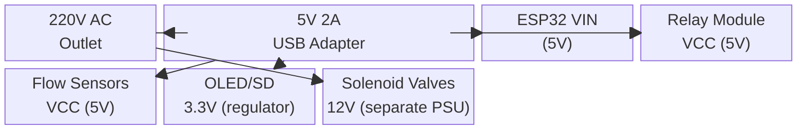
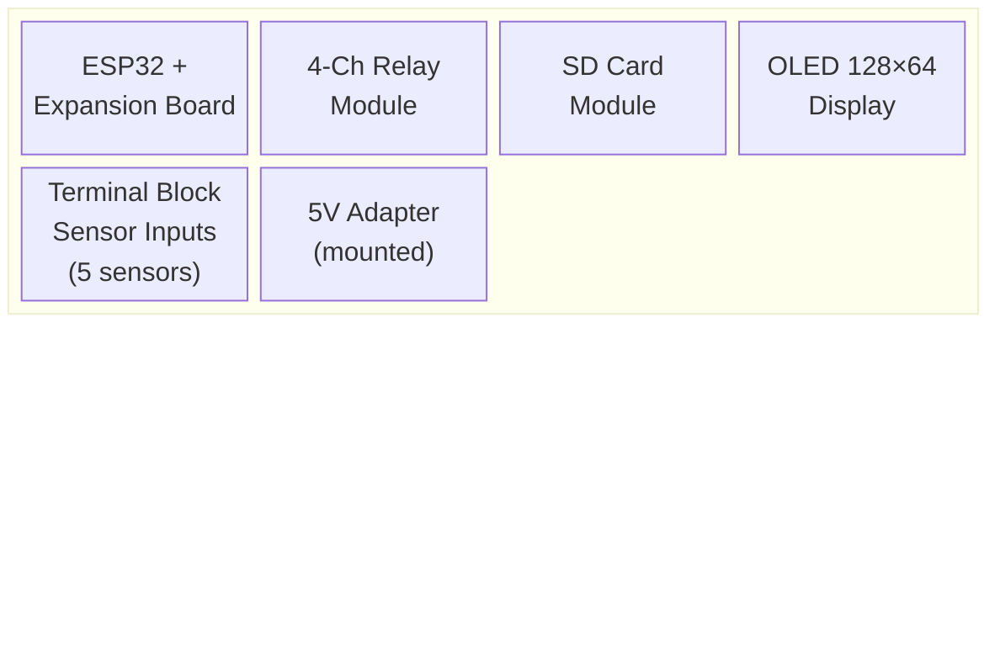

# Block Diagram — Water Meter with Leak Detection (ESP32 → Firebase → PythonAnywhere)

## System Block Diagram


---

## Pin Connections (ESP32 38-Pin with Expansion Board)

| Component | ESP32 Pin | Expansion Board | Notes |
|-----------|-----------|-----------------|-------|
| **Flow Sensor 1 — Inlet** | GPIO 34 | Screw terminal 1 | Input-only, **use 10kΩ pull-up to 3.3V** |
| **Flow Sensor 2 — Fixture 1** | GPIO 35 | Screw terminal 2 | Input-only, **use 10kΩ pull-up to 3.3V** |
| **Flow Sensor 3 — Fixture 2** | GPIO 32 | Screw terminal 3 | Use 10kΩ pull-up to 3.3V |
| **Flow Sensor 4 — Fixture 3** | GPIO 33 | Screw terminal 4 | Use 10kΩ pull-up to 3.3V |
| **Flow Sensor 5 — Fixture 4** | GPIO 25 | Screw terminal 5 | Use 10kΩ pull-up to 3.3V |
| **Relay 1 — Inlet Valve** | GPIO 26 | Screw terminal 6 | Active LOW |
| **Relay 2 — Fixture 1 Valve** | GPIO 27 | Screw terminal 7 | Active LOW |
| **Relay 3 — Fixture 2 Valve** | GPIO 14 | Screw terminal 8 | Active LOW |
| **Relay 4 — Fixture 3 Valve** | GPIO 12 | Screw terminal 9 | ⚠️ **Boot pin** — use pull-down resistor |
| **Relay 5 — Fixture 4 Valve** | GPIO 13 | Screw terminal 10 | Active LOW |
| **OLED SDA** | GPIO 21 | I²C header | Connect to OLED SDA |
| **OLED SCL** | GPIO 22 | I²C header | Connect to OLED SCL |
| **Buzzer** | GPIO 4 | GPIO header | Active buzzer (+ leg to GPIO, - to GND) |
| **Status LED** | GPIO 2 | Onboard | Built-in LED (active HIGH) |
| **RGB LED** | GPIO 5 | GPIO header | Use transistor driver or RGB module |
| **SD Card CS** | GPIO 5 | SPI header | ⚠️ Conflict with RGB — use different pin or mux |
| **SD Card MOSI** | GPIO 23 | SPI header | |
| **SD Card MISO** | GPIO 19 | SPI header | |
| **SD Card SCK** | GPIO 18 | SPI header | |

> **Critical:** GPIO 34 & 35 are **input-only pins** — they have no internal pull-up resistors. Always connect a **10kΩ resistor from the GPIO pin to 3.3V** for each flow sensor signal line.

---

## Wiring Diagram (Simplified)

```
ESP32 38-Pin Expansion Board
┌─────────────────────────────────────────────────────┐
│  [34]──10kΩ─┬── YF-S201 Outlet (Yellow)            │
│  [35]──10kΩ─┬── YF-S201 Fixture 1 (Yellow)         │
│  [32]──10kΩ─┬── YF-S201 Fixture 2 (Yellow)         │
│  [33]──10kΩ─┬── YF-S201 Fixture 3 (Yellow)         │
│  [25]──10kΩ─┬── YF-S201 Fixture 4 (Yellow)         │
│                                                     │
│  [26] ──────┬── Relay Module IN1                    │
│  [27] ──────┬── Relay Module IN2                    │
│  [14] ──────┬── Relay Module IN3                    │
│  [12] ──────┬── Relay Module IN4                    │
│  [13] ──────┬── Relay Module IN5 (if 5-ch)          │
│                                                     │
│  [21] ──────┬── OLED SDA                            │
│  [22] ──────┬── OLED SCL                            │
│                                                     │
│  5V  ──────┬── Relay Module VCC                     │
│  5V  ──────┬── YF-S201 VCC (Red wires)             │
│  GND ──────┬── All sensor GND (Black wires)        │
│  GND ──────┬── Relay Module GND                     │
│  GND ──────┬── OLED GND                             │
└─────────────────────────────────────────────────────┘
```

---

## Sensor Wiring (YF-S201)

```
YF-S201 Flow Sensor
┌──────────────┐
│              │
│  Red   ─────┼──── 5V (VIN from ESP32/Expansion Board)
│  Black ─────┼──── GND
│  Yellow ────┼──── GPIO (via 10kΩ pull-up to 3.3V)
│              │
│  [Flow →]    │   ← Arrow indicates water flow direction
└──────────────┘
```

> **Important:** The arrow on the sensor body MUST point in the direction of water flow. Installing it backwards will give no readings.

---

## Power Distribution



> **Note:** Solenoid valves typically require 12V / 1A minimum. Use a separate 12V power supply if including automatic shutoff valves. Do NOT power valves from the ESP32 5V rail.

---

## Component Layout (Enclosure)



> **Enclosure:** Use an ABS project box (200×120×70mm) with cable glands for waterproof sensor cable entry.

---

## Pinout Reference (ESP32 38-Pin)

```
                   ┌─────────────┐
              EN ──┤ 1         38├── VBAT
            GPIO36─┤ 2         37├── GPIO23 (SD MOSI)
            GPIO39─┤ 3         36├── GPIO22 (OLED SCL)
            GPIO34─┤ 4  E   P  35├── TXD0
            GPIO35─┤ 5  S   3  34├── RXD0
            GPIO32─┤ 6   P   2  33├── GPIO21 (OLED SDA)
            GPIO33─┤ 7   3   1  32├── GPIO19 (SD MISO)
            GPIO25─┤ 8   8      31├── GPIO18 (SD SCK)
            GPIO26─┤ 9          30├── GPIO5 (RGB/SD CS)
            GPIO27─┤10          29├── GPIO17 (TXD2)
            GPIO14─┤11          28├── GPIO16 (RXD2)
            GPIO12─┤12          27├── GPIO4 (Buzzer)
            GPIO13─┤13          26├── GPIO0 (BOOT)
              GND ─┤14          25├── GPIO2 (LED)
            GPIO15─┤15          24├── GPIO15
            ───────┤16          23├── GPIO13
              3.3V ─┤17          22├── ───────
              5V  ─┤18          21├── ───────
              GND ─┤19          20├── ───────
                   └─────────────┘
```

> Flow sensors on **input-only pins** (34, 35, 32, 33, 25) — safe and reliable for pulse counting.
