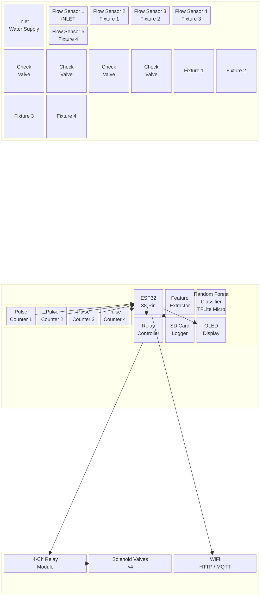
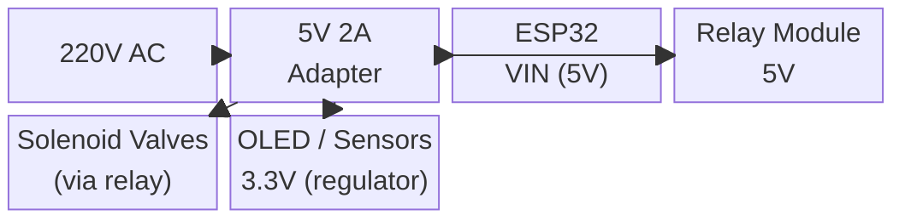
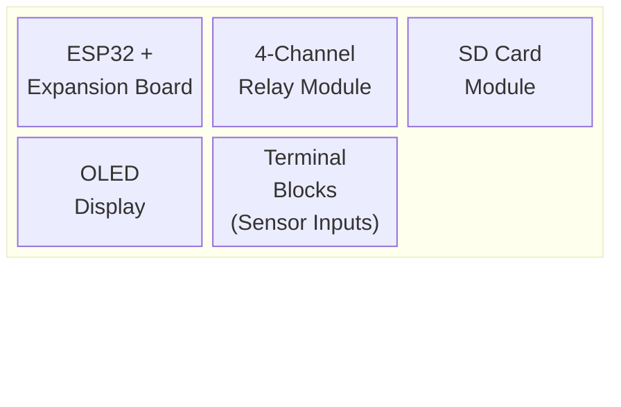

# Block Diagram — Water Meter with Fixture Leak Detection

## System Overview

## Pin Connections (ESP32 38-Pin)

| Component | ESP32 Pin | Notes |
|-----------|-----------|-------|
| **Flow Sensor 1 (Inlet)** | GPIO 34 | Pulse input, 10kΩ pull-up to 3.3V |
| **Flow Sensor 2 (Fixture 1)** | GPIO 35 | Pulse input, 10kΩ pull-up to 3.3V |
| **Flow Sensor 3 (Fixture 2)** | GPIO 32 | Pulse input, 10kΩ pull-up to 3.3V |
| **Flow Sensor 4 (Fixture 3)** | GPIO 33 | Pulse input, 10kΩ pull-up to 3.3V |
| **Flow Sensor 5 (Fixture 4)** | GPIO 25 | Pulse input, 10kΩ pull-up to 3.3V |
| **Relay 1 (Inlet Valve)** | GPIO 26 | Active LOW |
| **Relay 2 (Fixture 1 Valve)** | GPIO 27 | Active LOW |
| **Relay 3 (Fixture 2 Valve)** | GPIO 14 | Active LOW |
| **Relay 4 (Fixture 3 Valve)** | GPIO 12 | ⚠️ Boot pin — use with pull-down |
| **Relay 5 (Fixture 4 Valve)** | GPIO 13 | Active LOW |
| **OLED SDA** | GPIO 21 | I²C Data |
| **OLED SCL** | GPIO 22 | I²C Clock |
| **Buzzer** | GPIO 4 | Active buzzer (alert on leak) |
| **Status LED** | GPIO 2 | Onboard LED heartbeat |
| **RGB LED** | GPIO 5 | Normal=Green, Warning=Yellow, Leak=Red |
| **SD Card CS** | GPIO 5 | ⚠️ Shared — use mux or change pin |
| **SD Card MOSI** | GPIO 23 | SPI |
| **SD Card MISO** | GPIO 19 | SPI |
| **SD Card SCK** | GPIO 18 | SPI |

> **Important:** GPIOs 34 & 35 are **input-only** — no internal pull-up. Always use external 10kΩ pull-up resistors.

## Power Distribution

## Component Layout (Enclosure)

## Bill of Materials (Key Items)

| Component | Qty | Purpose |
|-----------|-----|---------|
| ESP32 38-Pin Dev Board | 1 | Main microcontroller |
| ESP32 38-Pin Expansion Board | 1 | Breakout + screw terminals |
| YF-S201 Flow Sensor | 5 | 1 inlet + 4 fixtures |
| Check Valve 1/2" | 4 | Prevent backflow per fixture |
| 4-Ch Relay Module | 1 | Valve control |
| Solenoid Valve 1/2" | 4 | Shutoff per fixture |
| OLED 128×64 | 1 | Display readings |
| Micro SD Card Module | 1 | Local data logging |
| Active Buzzer | 1 | Leak alarm |
| Breadboard + Jumpers | 1 set | Prototyping |

> See [BOM](./bom.md) for complete list with prices and links.
