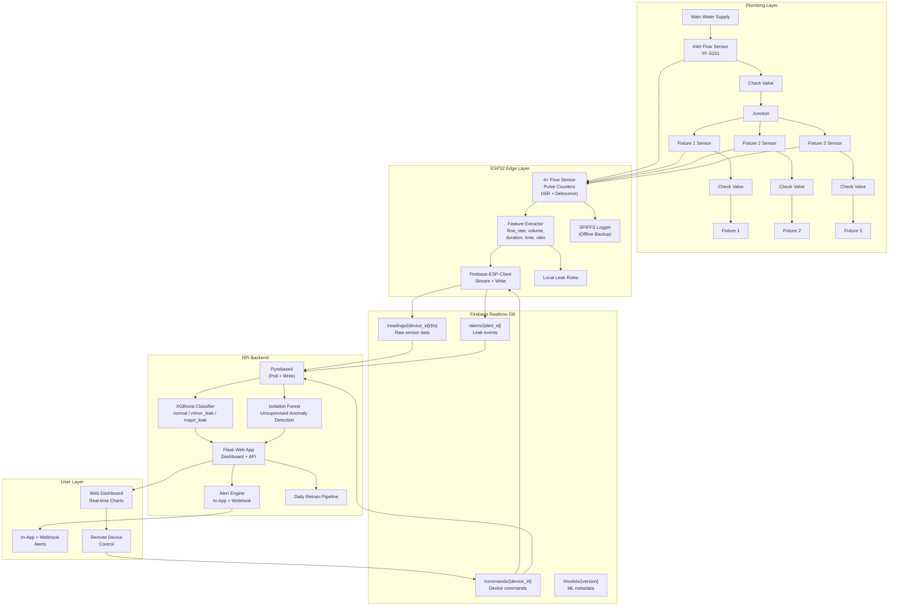
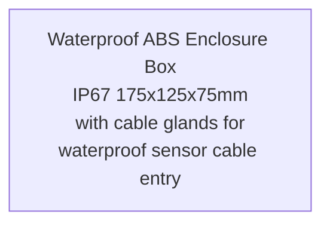

# Block Diagram — Water Meter with Leak Detection (ESP32 → Firebase → RPi)

## System Block Diagram

> Mermaid-based diagram (SVG export removed; source below)

<details>
<summary><b> Mermaid Source</b> (click to expand)</summary>



</details>

---

## Pin Connections (ESP32 38-Pin with Expansion Board)

| Component | ESP32 Pin | Expansion Board | Notes |
|-----------|-----------|-----------------|-------|
| **Flow Sensor 1 — Inlet** | GPIO 26 | JST-XH 3-pin Female | Direct connection, no pull-up needed |
| **Flow Sensor 2 — Fixture 1 (Bidet)** | GPIO 25 | JST-XH 3-pin Female | Direct connection |
| **Flow Sensor 3 — Fixture 2 (Kitchen)** | GPIO 33 | JST-XH 3-pin Female | Direct connection |
| **Flow Sensor 4 — Fixture 3 (Bathroom Shower)** | GPIO 32 | JST-XH 3-pin Female | Direct connection |

---

## Wiring Diagram

### Interactive Wiring Diagram (Cirkit Designer)
**🔗 [View Interactive Wiring Diagram](https://app.cirkitdesigner.com/project/4f173a2b-5656-48ff-b98f-183483fecb1e)**

### Static Wiring Diagram (PNG)


### Wiring Source File
[Download .ckt file](../wiring/wmldad.ckt) — Open in [Cirkit Designer](https://app.cirkitdesigner.com/)

---

## Simplified Wiring

```
ESP32 38-Pin Expansion Board
┌─────────────────────────────────────────────────────┐
│  [26] ──────┬── YF-S201 Inlet (Yellow)              │
│  [25] ──────┬── YF-S201 Fixture 1 (Yellow)          │
│  [33] ──────┬── YF-S201 Fixture 2 (Yellow)          │
│  [32] ──────┬── YF-S201 Fixture 3 (Yellow)          │
│                                                     │
│  5V  ──────┬── YF-S201 VCC (Red wires)             │
│  GND ──────┬── All sensor GND (Black wires)        │
└─────────────────────────────────────────────────────┘
```

---

## Sensor Wiring (YF-S201)

```
YF-S201 Flow Sensor
┌──────────────┐
│              │
│  Red   ─────┼──── 5V (VIN from ESP32/Expansion Board)
│  Black ─────┼──── GND
│  Yellow ────┼──── GPIO (26, 25, 33, 32) — direct connection
│              │
│  [Flow →]    │   ← Arrow indicates water flow direction
└──────────────┘
```

> **Important:** The arrow on the sensor body MUST point in the direction of water flow. Installing it backwards will give no readings.

---

## Sensor Wiring (YF-S201)

Each YF-S201 sensor has 3 wires: **Red (VCC)**, **Black (GND)**, **Yellow (Signal)**

| Connection | JST-XH 3-pin | Wire Color | Pin |
|------------|--------------|------------|-----|
| VCC | Pin 1 | Red | 5V |
| GND | Pin 2 | Black | GND |
| Signal | Pin 3 | Yellow | GPIO (26, 25, 33, 32) |

**Connector Setup:**
- **Sensor side:** JST-XH 3-pin **Male** (crimped to sensor wires)
- **Board/perf board side:** JST-XH 3-pin **Female** (soldered to perf board)
- **Power input:** Terminal Block 2-pin Blue (5mm pitch) for 5V/GND from buck converter

> **Note:** JST-XH connectors are purchased **pre-crimped / ready-to-use** — no crimp kit or crimping tool needed. Just solder the female connectors to the perf board and plug in the sensor cables.

---

## Power Distribution

> Mermaid-based diagram (SVG export removed; source below)

<details>
<summary><b> Mermaid Source</b> (click to expand)</summary>

```mermaid
graph LR
    AC[220V AC<br/>Outlet] --> PSU12[12V 5A Switching PSU<br/>(S-60-12 / LRS-60-12)]
    PSU12 --> Buck[LM2596S<br/>12V to 5V<br/>Buck Converter]
    Buck --> ESPV[ESP32 VIN<br/>(5V)]
    Buck --> SensorV[Flow Sensors<br/>VCC (5V)]
```

</details>

> **Power Architecture:**
> - **220V AC** to **12V 5A Switching Power Supply (S-60-12 / LRS-60-12)**
> - **12V** to **LM2596S Buck Converter** to **5V** for ESP32 + sensors
> - 12V rail available for future 12V components if needed

---

## Component Layout (Enclosure)

> Mermaid-based diagram (SVG export removed; source below)

<details>
<summary><b> Mermaid Source</b> (click to expand)</summary>



</details>

> **Enclosure:** Waterproof ABS Enclosure Box IP67 175x125x75mm with cable glands for waterproof sensor cable entry.

---

## Pinout Reference (ESP32 DevKit V1 38-Pin)

```
                   ┌─────────────┐
             EN ──┤ 1         38├── VBAT
           GPIO36─┤ 2         37├── GPIO15 (HSPI_CS)
           GPIO39─┤ 3         36├── GPIO2 (LED)
           GPIO34─┤ 4         35├── GPIO0 (BOOT)
           GPIO35─┤ 5         34├── GPIO4
           GPIO32─┤ 6         33├── GPIO16 (RXD2)
           GPIO33─┤ 7         32├── GPIO17 (TXD2)
           GPIO25─┤ 8         31├── GPIO5
           GPIO26─┤ 9         30├── GPIO18
           GPIO27─┤ 10        29├── GPIO19
           GPIO14─┤ 11        28├── GPIO21
           GPIO12─┤ 12        27├── GPIO22
           GPIO13─┤ 13        26├── GPIO23
              GND─┤ 14        25├── RXD0 (GPIO3)
           GPIO15─┤ 15        24├── TXD0 (GPIO1)
              GND─┤ 16        23├── (NC)
            3.3V ─┤ 17        22├── (NC)
             5V  ─┤ 18        21├── (NC)
              GND─┤ 19        20├── GND
                   └─────────────┘
```

> **Flow sensors on GPIO 26, 25, 33, 32** (physical pins 9, 8, 7, 6) — direct connection, no pull-up resistors or capacitors needed (YF-S201 outputs digital pulses).

---

## Wiring Summary for 4 Flow Sensors

Each YF-S201 sensor has 3 wires: **Red (VCC)**, **Black (GND)**, **Yellow (Signal)**

| Connection | JST-XH 3-pin | Wire Color | Pin |
|------------|--------------|------------|-----|
| VCC | Pin 1 | Red | 5V |
| GND | Pin 2 | Black | GND |
| Signal | Pin 3 | Yellow | GPIO (26, 25, 33, 32) |

**Connector Setup:**
- **Sensor side:** JST-XH 3-pin **Male** (crimped to sensor wires)
- **Board/perf board side:** JST-XH 3-pin **Female** (soldered to perf board)
- **Power input:** Terminal Block 2-pin Blue (5mm pitch) for 5V/GND from buck converter

> **Note:** JST-XH connectors are purchased **pre-crimped / ready-to-use** — no crimp kit or crimping tool needed. Just solder the female connectors to the perf board and plug in the sensor cables.

---

## Wiring Resources

| Resource | Description | Link |
|----------|-------------|------|
| **Interactive Wiring Diagram** | Cirkit Designer (clickable, zoomable) | [app.cirkitdesigner.com/project/4f173a2b-5656-48ff-b98f-183483fecb1e](https://app.cirkitdesigner.com/project/4f173a2b-5656-48ff-b98f-183483fecb1e) |
| **Static Wiring Diagram** | PNG image for docs | `../wiring/wmldad.png` |
| **Cirkit Designer Source** | Editable .ckt file | `../wiring/wmldad.ckt` |

---

## 3D Enclosure Models

All 3D models and Fusion 360 source files are in the `model/` folder:

| File | Description |
|------|-------------|
| `water-meter-fusion-360-file.f3d` | Fusion 360 source file (editable) |
| `water-meter-fixture.png` | Main fixture assembly render |
| `water-meter-fixture-1.png` | Fixture view 1 |
| `water-meter-fixture-2.png` | Fixture view 2 |
| `water-meter-fixture-3.png` | Fixture view 3 |
| `water-meter-fixture-4.png` | Fixture view 4 |
| `water-meter-fixture-5.png` | Fixture view 5 |
| `water-meter-fixture-6.png` | Fixture view 6 |
| `water-meter-fixture-7.png` | Fixture view 7 |
| `water-meter-fixture-8.png` | Fixture view 8 |
| `water-meter-fixture-9.png` | Fixture view 9 |
| `water-meter-fixture-10.png` | Fixture view 10 |
| `water-meter-fixture-11.png` | Fixture view 11 |
| `water-meter-fixture-12.png` | Fixture view 12 |
| `water-meter-fixture-13.png` | Fixture view 13 |

> Use the `.f3d` file in Fusion 360 to modify the enclosure design, add mounting holes, or adjust dimensions for different components.