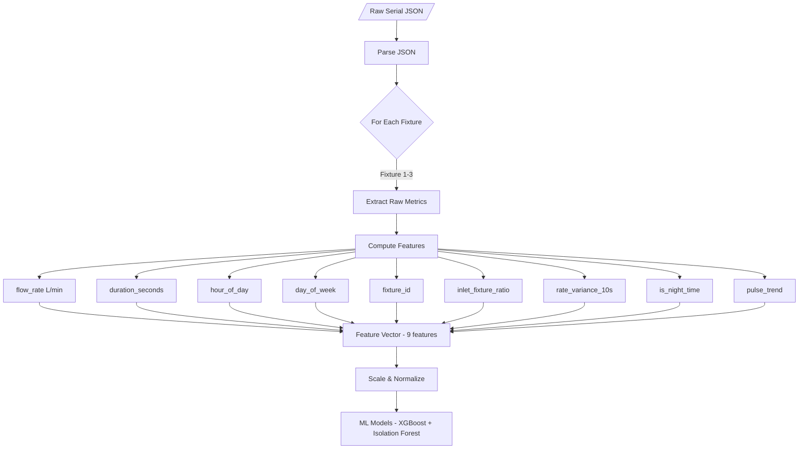
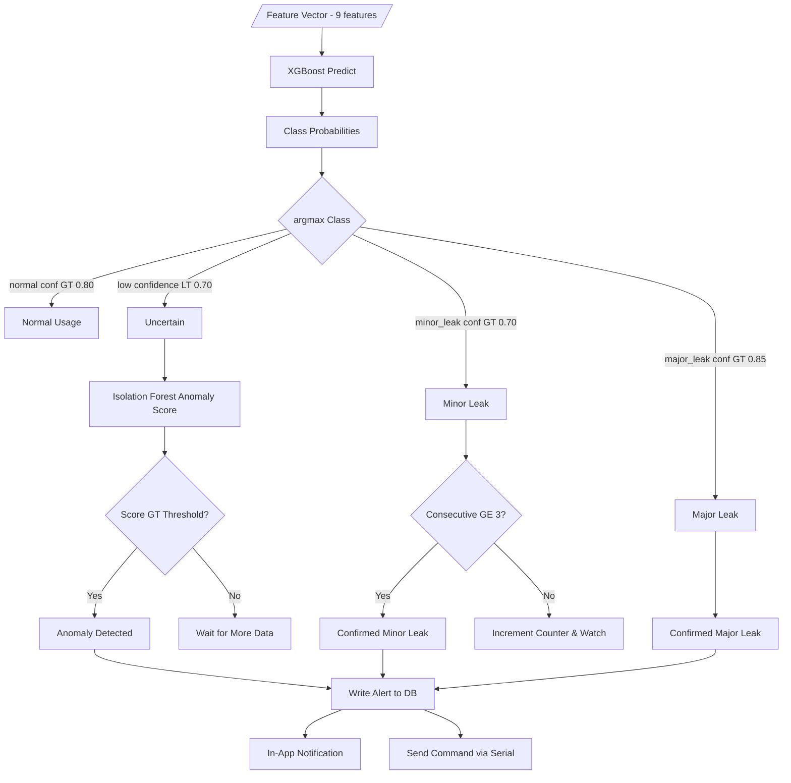
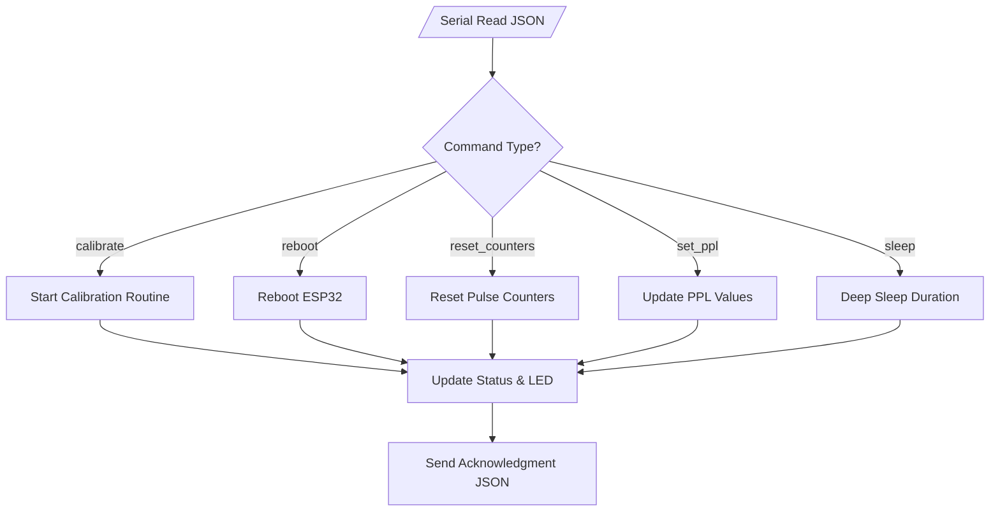
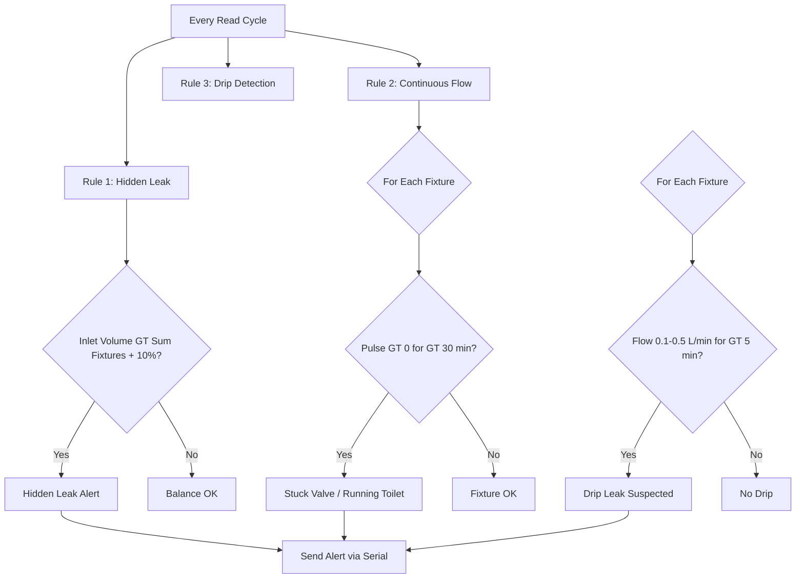

```mermaid
flowchart LR
    %% Physical Layer
    Water[/Water Flow/]:::physical --> Sensor[YF-S201 Flow Sensor]:::physical
    Sensor --> Pulse[/Pulse Signal/]:::physical
    
    %% Firmware Layer
    Pulse --> ISR[ISR Pulse Counter]:::firmware
    ISR --> Debounce[Debounce 5ms]:::firmware
    Debounce --> Calc[Calculate Flow & Volume]:::firmware
    Calc --> LocalRules[Local Leak Rules]:::firmware
    Calc --> SerialOut[USB Serial Output]:::firmware
    LocalRules --> SerialOut
    
    %% USB Layer
    SerialOut -->|USB CDC/ACM 921600 baud| USB[USB Cable]:::usb
    
    %% Backend Layer
    USB -->|pyserial| PySerial[/PySerial Reader/]:::backend
    PySerial --> Parser[JSON Parser]:::backend
    Parser --> Features[Feature Extraction]:::backend
    Features --> XGB[XGBoost Inference]:::ml
    Features --> IF[Isolation Forest Anomaly]:::ml
    XGB --> AlertEngine[Alert Engine]:::backend
    IF --> AlertEngine
    AlertEngine --> Notify[In-App Notification]:::user
    AlertEngine --> DB[(SQLite/InfluxDB)]:::backend
    
    %% User Layer
    DB --> Dashboard[Web Dashboard]:::user
    USB -->|Commands| CmdHandler[Command Handler]:::firmware
    
    classDef physical fill:#e1f5fe,stroke:#0288d1,stroke-width:2px
    classDef firmware fill:#fff3e0,stroke:#f57c00,stroke-width:2px
    classDef usb fill:#e8f5e9,stroke:#388e3c,stroke-width:2px
    classDef backend fill:#f3e5f5,stroke:#7b1fa2,stroke-width:2px
    classDef ml fill:#fce4ec,stroke:#c62828,stroke-width:2px
    classDef user fill:#fffde7,stroke:#f9a825,stroke-width:2px
```

# Flowchart — Water Meter with Leak Detection (ESP32 → USB Serial → RPi Backend)

## 1. Main System Flow (High-Level)

> Mermaid-based diagram (SVG export removed; source below)

<details>
<summary><b> Mermaid Source</b> (click to expand)</summary>

```mermaid
flowchart TD
    Start((Start)) --> Init[ESP32 Initialization]
    Init --> Sensors[Initialize 4 Flow Sensors & Attach ISRs]
    Sensors --> SerialInit[Initialize USB Serial (921600 baud)]
    SerialInit --> MainLoop[Enter Main Loop]
    
    MainLoop --> ReadPulses[Read All Pulse Counters]
    ReadPulses --> CalcFlow[Calculate Flow Metrics per Fixture]
    CalcFlow --> UpdateLED[Update Status LEDs]
    UpdateLED --> LocalRules[Apply Local Leak Rules]
    
    LocalRules --> Interval{Upload Interval?}
    Interval -->|Yes| SendSerial[Send JSON to Serial]
    Interval -->|No| CmdCheck{Command Received?}
    
    SendSerial --> ClearBuf[Clear Local Buffer]
    ClearBuf --> CmdCheck
    
    CmdCheck -->|Yes| ExecCmd[Execute Command]
    CmdCheck -->|No| MainLoop
    
    ExecCmd -->|Calibrate| CalMode[Enter Calibration Mode]
    ExecCmd -->|Reboot| Reboot[Reboot ESP32]
    ExecCmd -->|Set PPL| SetPPL[Update PPL Values]
    CalMode --> MainLoop
    Reboot --> Start
    SetPPL --> MainLoop
```

</details>

---

## 2. USB Serial Data Flow (ESP32 → RPi)

> Mermaid-based diagram (SVG export removed; source below)

<details>
<summary><b> Mermaid Source</b> (click to expand)</summary>

```mermaid
flowchart LR
    subgraph ESP32["ESP32 (Arduino Serial)"]
        ESP_Read[/Read Sensors/] --> ESP_Build[Build JSON Payload]
        ESP_Build --> ESP_Serial[Serial.println(JSON)]
        ESP_Cmd[/Read Serial/] --> ESP_CmdCheck{New Command?}
        ESP_CmdCheck -->|calibrate| ESP_Cal[Enter Calibration]
        ESP_CmdCheck -->|reboot| ESP_Reboot[Reboot ESP32]
        ESP_CmdCheck -->|set_ppl| ESP_SetPPL[Update PPL]
    end
    
    subgraph USB["USB Cable (CDC/ACM)"]
        ESP_Serial --> USB_Data[JSON Lines @ 921600 baud]
        USB_Cmd[Commands from RPi] --> ESP_Cmd
    end
    
    subgraph RPi["RPi Backend (pyserial + asyncio)"]
        USB_Data --> RPi_Reader[Serial Reader Thread]
        RPi_Reader --> RPi_Parse[JSON Parser]
        RPi_Parse --> RPi_Features[Extract Features]
        RPi_Features --> RPi_XGB[XGBoost Inference]
        RPi_Features --> RPi_IF[Isolation Forest]
        RPi_XGB --> RPi_Leak{Leak Detected?}
        RPi_IF --> RPi_Leak
        RPi_Leak -->|Yes| RPi_Alert[Write Alert to DB]
        RPi_Leak -->|No| RPi_Log[Log Normal]
        RPi_Alert --> RPi_Notify[In-App Notification]
        
        RPi_Cmd[Dashboard Command] --> USB_Cmd
    end
    
    subgraph User["User Interface"]
        User_Dash[/Web Dashboard/] --> RPi_Log
        User_Dash --> RPi_Alert
        User_Alert[/In-App Alert/] --> RPi_Notify
        User_Cmd[/User Command/] --> RPi_Cmd
    end
```

</details>

---

## 3. ESP32 ISR Pulse Processing

> Mermaid-based diagram (SVG export removed; source below)

<details>
<summary><b> Mermaid Source</b> (click to expand)</summary>

```mermaid
flowchart TD
    Pulse[/Pulse from Flow Sensor/] --> ISR[ISR Triggered]
    ISR --> Time[Read millis()]
    Time --> Debounce{Debounce Check dt > 5ms?}
    Debounce -->|Yes| Count[Increment Pulse Counter]
    Debounce -->|No| Ignore[Ignore - Bounce]
    Count --> Update[Update Last Pulse Time]
    Ignore --> Return[Return to Main Loop]
    Update --> Return
```

</details>

---

## 4. RPi Feature Extraction Pipeline

> Mermaid-based diagram (SVG export removed; source below)

<details>
<summary><b> Mermaid Source</b> (click to expand)</summary>



</details>

---

## 5. ML Inference & Decision Flow

> Mermaid-based diagram (SVG export removed; source below)

<details>
<summary><b> Mermaid Source</b> (click to expand)</summary>



</details>

---

## 6. ESP32 Serial Command Execution

> Mermaid-based diagram (SVG export removed; source below)

<details>
<summary><b> Mermaid Source</b> (click to expand)</summary>



</details>

---

## 7. Local Leak Detection Rules (ESP32 Fallback)

> Mermaid-based diagram (SVG export removed; source below)

<details>
<summary><b> Mermaid Source</b> (click to expand)</summary>



</details>

---

## 8. Full System Data Flow

> Mermaid-based diagram (SVG export removed; source below)

<details>
<summary><b> Mermaid Source</b> (click to expand)</summary>



</details>