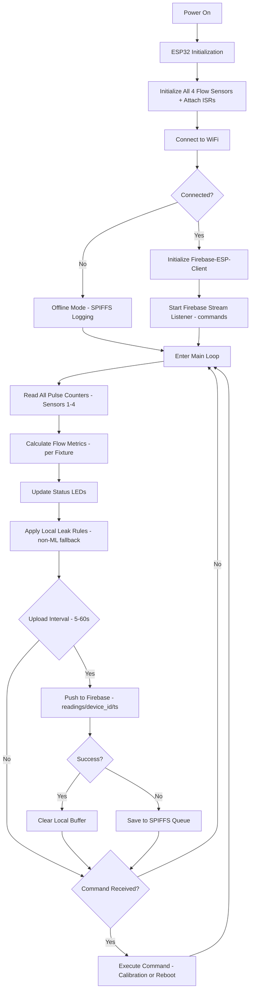
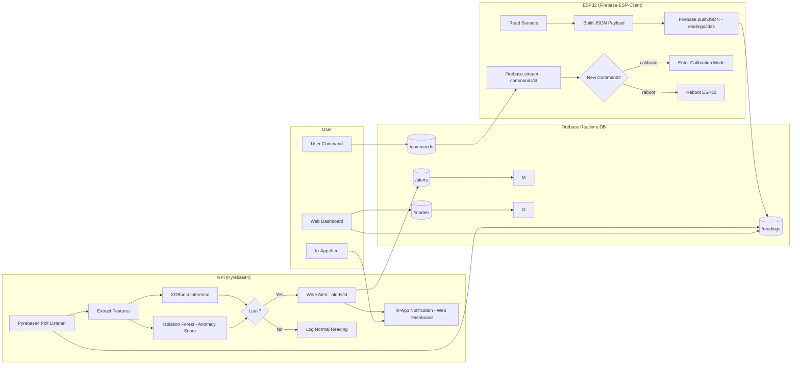
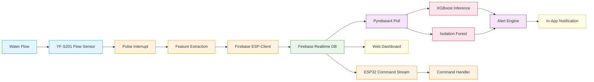

# Flowchart — Water Meter with Leak Detection (ESP32 → Firebase → RPi Backend)

## 1. Main System Flow (High-Level)

> Mermaid-based diagram (SVG export removed; source below)

<b> Mermaid Source</b> (click to expand)

---

## 2. Firebase Data Flow (ESP32 to Firebase to RPi)

> Mermaid-based diagram (SVG export removed; source below)

<b> Mermaid Source</b> (click to expand)

---

## 8. Data Flow Diagram (Full System)

> Mermaid-based diagram (SVG export removed; source below)

<b> Mermaid Source</b> (click to expand)

