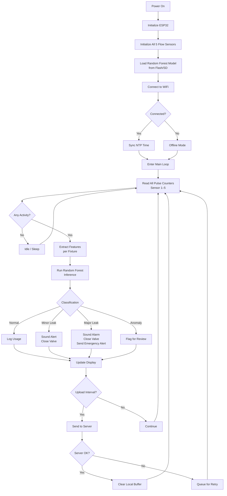
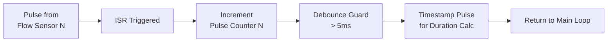
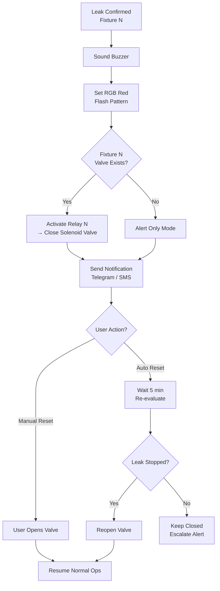
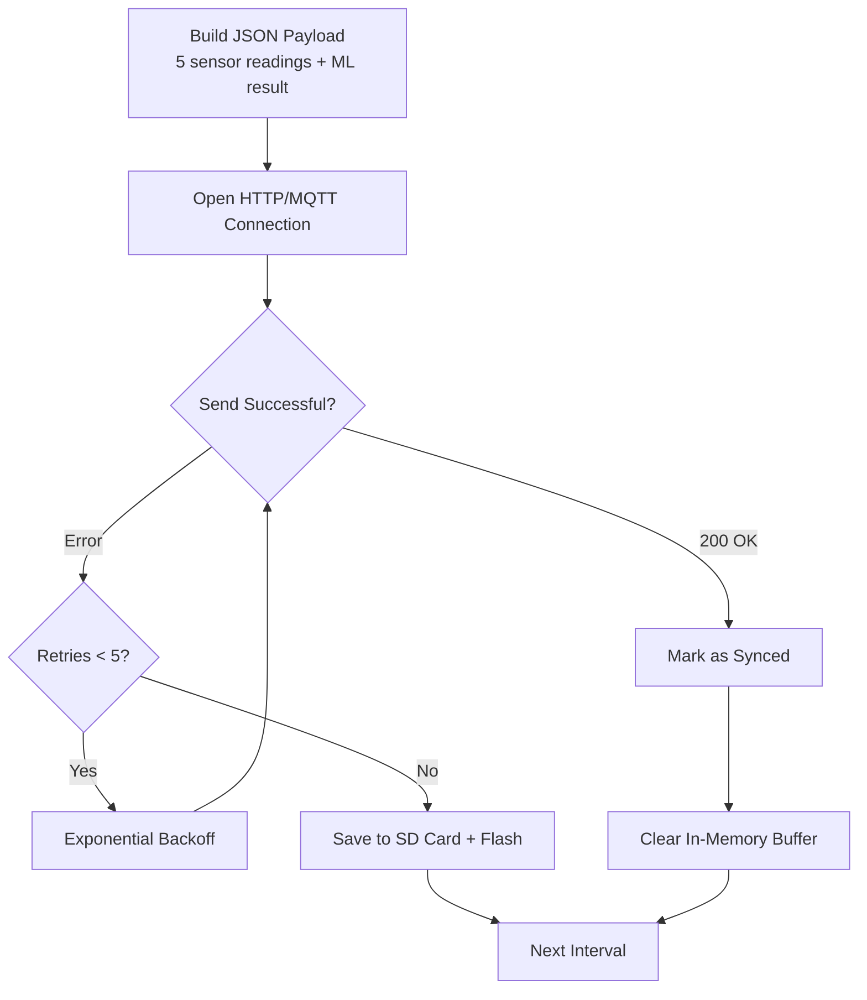
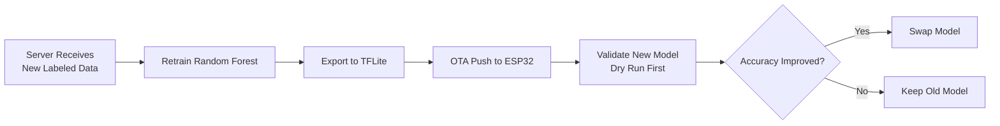

# Flowchart — Water Meter with Leak Detection

## 1. Main System Flow



## 2. Pulse Interrupt Flow



## 3. Leak Detection Flow (ML Inference)

```mermaid
flowchart TD
    A[Features Collected] --> B[Normalize Features]
    B --> C[Feed to Random Forest<br/>TensorFlow Lite Model]
    C --> D[Get Probabilities<br/>Normal / Minor Leak / Major Leak / Anomaly]
    D --> E{Confidence > 80%?}
    
    E -->|No| F[Wait for More Data<br/>Buffer Next N Readings]
    F --> C
    
    E -->|Yes| G{Prediction?}
    
    G -->|Normal| H[Reset Leak Counters<br/>Green LED]
    G -->|Minor Leak| I[Increment Minor Count]
    I --> J{Count > 3}<br/>consecutive?
    J -->|Yes| K[CONFIRMED MINOR LEAK]
    J -->|No| H
    
    G -->|Major Leak| L[CONFIRMED MAJOR LEAK]
    G -->|Anomaly| M[Log Anomaly Features]
```

## 4. Valve Control Flow



## 5. Data Upload Flow



## 6. ML Model Update Flow


