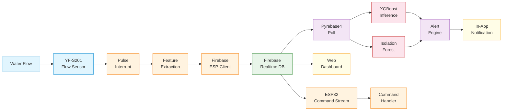

# Flowchart — Water Meter with Leak Detection (ESP32 → Firebase → RPi Backend)

## 1. Main System Flow (High-Level)

> Mermaid-based diagram (SVG export removed; source below)

<details>
<summary><b> Mermaid Source</b> (click to expand)</summary>

```mermaid
flowchart TD
    A[Power On] --> B[ESP32 Initialization]
    B --> C[Initialize All 4 Flow Sensors
+ Attach ISRs]
    C --> D[Connect to WiFi]
    D --> E{Connected?}
    E -->|Yes| F[Initialize Firebase-ESP-Client]
    E -->|No| G[Offline Mode
→ SPIFFS Logging]
    F --> H[Start Firebase Stream Listener
(commands)]
    G --> I[Enter Main Loop]
    H --> I
    
    I --> J[Read All Pulse Counters
Sensors 1–4]
    J --> K[Calculate Flow Metrics
per Fixture]
    K --> L[Update Status LEDs]
    L --> M[Apply Local Leak Rules
(non-ML fallback)]
    
    M --> N{Upload Interval?
(5–60s)}
    N -->|Yes| O[Push to Firebase
→ /readings/{device_id}/{ts}]
    N -->|No| P{Command Received?}
    
    O --> Q{Success?}
    Q -->|Yes| R[Clear Local Buffer]
    Q -->|No| S[Save to SPIFFS Queue]
    
    R --> P
    S --> P
    
    P -->|Yes| T[Execute Command
→ Calibration / Reboot]
    P -->|No| I
    
    T --> I
```

</details>

---

## 2. Firebase Data Flow (ESP32 → Firebase → RPi)

> Mermaid-based diagram (SVG export removed; source below)

<details>
<summary><b> Mermaid Source</b> (click to expand)</summary>

```mermaid
flowchart LR
    subgraph "ESP32 (Firebase-ESP-Client)"
        A[Read Sensors] --> B[Build JSON
Payload]
        B --> C[Firebase.pushJSON
→ /readings/{id}/{ts}]
        D[Firebase.stream
← /commands/{id}]
        D --> E{New Command?}
        E -->|calibrate| H[Enter Calibration Mode]
        E -->|reboot| I[Reboot ESP32]
    end
    
    subgraph "Firebase Realtime DB"
        C --> J[(/readings)]
        K[(/commands)] --> D
        L[(/alerts)] --> M
        N[(/models)] --> O
    end
    
    subgraph "RPi (Pyrebase4)"
        P[Pyrebase4
Poll Listener] --> J
        P --> Q[Extract Features]
        Q --> R[XGBoost Inference]
        Q --> S[Isolation Forest
Anomaly Score]
        R --> T{Leak?}
        S --> T
        T -->|Yes| U[Write Alert
→ /alerts/{id}]
        U --> L
        T -->|No| V[Log Normal Reading]
        U --> W[In-App Notification
(Web Dashboard)]
    end
    
    subgraph "User"
        X[Web Dashboard] --> N
        X --> J
        Y[In-App Alert] --> W
        Z[User Command] --> K
    end
```

</details>

---

## 3. Pulse Interrupt Flow (ESP32 ISR)

> Mermaid-based diagram (SVG export removed; source below)

<details>
<summary><b> Mermaid Source</b> (click to expand)</summary>

```mermaid
flowchart TD
    A[Pulse from
Flow Sensor N] --> B[ISR Triggered]
    B --> C[Read millis()]
    C --> D{ millis() - lastPulseTime[N]
> 5ms ?}
    D -->|Yes (valid pulse)| E[Increment pulseCount[N]]
    D -->|No (bounce)| F[Ignore]
    E --> G[Update lastPulseTime[N]]
    G --> H[Return to Main Loop]
    F --> H
```

</details>

---

## 4. Feature Extraction Flow (RPi Backend)

> Mermaid-based diagram (SVG export removed; source below)

<details>
<summary><b> Mermaid Source</b> (click to expand)</summary>

```mermaid
flowchart TD
    A[Raw Firebase Data] --> B[Parse JSON]
    B --> C[For each fixture:
extract raw metrics]
    C --> D[Compute Features]
    
    D --> D1["flow_rate (L/min)"]
    D --> D2["duration_seconds"]
    D --> D3["hour_of_day"]
    D --> D4["day_of_week"]
    D --> D5["fixture_id (encoded)"]
    D --> D6["inlet_to_fixture_ratio"]
    D --> D7["rate_variance (10s window)"]
    D --> D8["is_night_time"]
    D --> D9["pulse_trend (slope)"]
    
    D1 --> E[Feature Vector
(9–12 features)]
    D2 --> E
    D3 --> E
    D4 --> E
    D5 --> E
    D6 --> E
    D7 --> E
    D8 --> E
    D9 --> E
    
    E --> F[Scale / Normalize]
    F --> G[← XGBoost + Isolation Forest]
```

</details>

---

## 5. XGBoost ML Inference Flow

> Mermaid-based diagram (SVG export removed; source below)

<details>
<summary><b> Mermaid Source</b> (click to expand)</summary>

```mermaid
flowchart TD
    A[Feature Vector
(9 features)] --> B[XGBoost Predict]
    B --> C[Class Probabilities]
    C --> D{argmax class}
    
    D -->|normal
confidence > 0.80| E[ Normal Usage]
    D -->|minor_leak
confidence > 0.70| F[ Minor Leak]
    D -->|major_leak
confidence > 0.85| G[ Major Leak]
    D -->|low confidence
< 0.70| H[ Uncertain]
    
    H --> I[Isolation Forest
Anomaly Score]
    I --> J{Anomaly?}
    J -->|score > threshold| K[ Anomaly Detected]
    J -->|normal| L[Wait for more data]
    
    F --> M{Consecutive count}
    M -->|≥ 3| N[CONFIRMED MINOR LEAK]
    M -->|< 3| O[Increment counter → watch]
    
    G --> P[CONFIRMED MAJOR LEAK]
    K --> Q[Write to /alerts]
    N --> Q
    P --> Q
    
    Q --> R[In-App Notification
(Web Dashboard)]
    Q --> S[Write Command
→ /commands/{id}]
```

</details>

---

## 6. Command Execution Flow (ESP32)

> Mermaid-based diagram (SVG export removed; source below)

<details>
<summary><b> Mermaid Source</b> (click to expand)</summary>

```mermaid
flowchart TD
    A[Firebase Stream Event
← /commands/{device_id}] --> B{Command Type?}
    
    B -->|calibrate| J[Start Calibration
Routine]
    B -->|reboot| I[Reboot ESP32]
    
    J --> K[Update Status
+ LED Indicators]
    I --> K
    
    K --> L[Acknowledge to Firebase
→ command_acknowledged]
```

</details>

---

## 7. Local Leak Rules (ESP32 Fallback — No ML)

> Mermaid-based diagram (SVG export removed; source below)

<details>
<summary><b> Mermaid Source</b> (click to expand)</summary>

```mermaid
flowchart TD
    A[Every Read Cycle] --> B[Check inlet vs sum of fixtures]
    B --> C{Inlet volume >
sum(fixtures) + 10%?}
    C -->|Yes| D[Hidden Leak Suspected
→ Alert Locally]
    C -->|No| E[Balance OK]
    
    A --> F[Check individual fixture
continuous flow > 30 min]
    F --> G{Pulse count > 0
for > 30 min?}
    G -->|Yes| H[Possible Stuck Valve /
Running Toilet]
    G -->|No| I[Fixture OK]
    
    D --> J[Send Firebase Alert]
    H --> J
    
    A --> K[Check for very low
continuous flow]
    K --> L{Flow 0.1–0.5 L/min
for > 5 min?}
    L -->|Yes| M[Drip Leak Suspected]
    M --> J
    L -->|No| N[No Leak]
```

</details>

---

## 8. Data Flow Diagram (Full System)

> Mermaid-based diagram (SVG export removed; source below)

<details>
<summary><b> Mermaid Source</b> (click to expand)</summary>



</details>