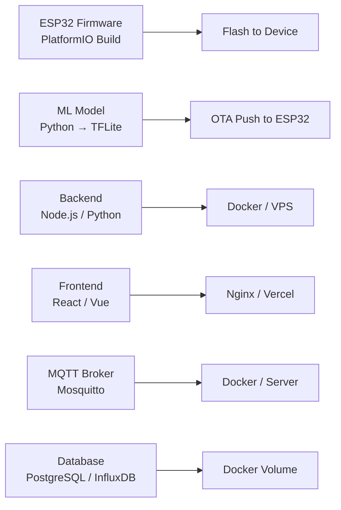

# Technology Stack — Water Meter with Fixture Leak Detection

## Hardware

| Component | Technology | Qty |
|-----------|------------|-----|
| Microcontroller | **ESP32 38-Pin** (CP2102, Xtensa LX6, WiFi + BLE) | 1 |
| Expansion Board | **ESP32 38-Pin Breakout Board** (screw terminals) | 1 |
| Flow Sensor | **YF-S201** 1/2" Hall-effect pulse output | 5 |
| Check Valve | 1/2" Brass/PVC non-return valve | 4 |
| Solenoid Valve | 1/2" NC (Normally Closed) 12V or Motorized Ball Valve | 4 |
| Relay Module | **4-Channel 5V** optocoupler isolated, active LOW | 1 |
| Display | **OLED 128×64** (SSD1306, I²C, 0.96") | 1 |
| Storage | **Micro SD Card Module** (SPI) + 16GB Class 10 | 1 |
| Alert | Active Buzzer 5V | 1 |
| Indicator | RGB LED (common cathode) + Status LEDs | 1+3 |
| Power | 5V 2A USB Adapter | 1 |
| Voltage Reg | LM2596 DC-DC Step-Down (optional) | 1 |

---

## Firmware (ESP32)

| Layer | Technology |
|-------|------------|
| Framework | Arduino Framework / ESP-IDF |
| Language | C++ (Arduino) |
| IDE | PlatformIO (recommended) / Arduino IDE |
| Sensors | Hardware Interrupts × 5 (different GPIOs with debounce) |
| ML Inference | **TensorFlow Lite Micro** (TFLite Micro) |
| ML Model | **Random Forest** → exported to TFLite via [m2cgen](https://github.com/BayesWitnesses/m2cgen) or [sklearn-onnx2tf](https://github.com/PINTO0309/sklearn-onnx2tf) |
| WiFi | WiFi.h (Arduino Core) |
| MQTT | PubSubClient.h |
| HTTP | HTTPClient.h / AsyncHTTPRequest |
| JSON | ArduinoJson |
| Storage | SD_MMC.h (SD card) + SPIFFS.h (fallback) |
| Display | Adafruit SSD1306 + GFX |
| Time | NTPClient.h / configTime() |
| OTA | ArduinoOTA / ESP32 HTTP OTA |

---

## ML Pipeline (Backend / Training)

| Layer | Technology |
|-------|------------|
| Language | **Python 3.9+** |
| ML Framework | **scikit-learn** (RandomForestClassifier) |
| Feature Engineering | pandas, numpy |
| Model Conversion | scikit-learn → ONNX → TensorFlow Lite |
| Model Size | ~50–100 KB (compressed TFLite) |
| Inference RAM | ~16 KB (peak) on ESP32 |
| Retraining | Batch retrain every 7 days or 1000 new samples |
| Experiment Tracking | MLflow / Weights & Biases (optional) |

### Feature Set for Leak Detection

| Feature | Description | Type |
|---------|-------------|------|
| `flow_rate` | Instantaneous flow rate (L/min) | float |
| `duration` | Seconds since flow started | int |
| `hour` | Hour of day (0–23) | int |
| `day_of_week` | Day (0=Mon, 6=Sun) | int |
| `fixture_id` | One-hot encoded ±1..5 | int |
| `inlet_to_fixture_ratio` | Inlet rate ÷ fixture rate | float |
| `rate_variance` | Variance over last 10 seconds | float |
| `is_night_time` | 22:00–05:00 flag | bool |
| `avg_rate_1min` | Rolling average (1 min window) | float |
| `pulse_trend` | Slope of pulses over last 5 readings | float |

### Target Classes

| Class | Description | Action |
|-------|-------------|--------|
| `normal` | Regular water usage | Log only |
| `minor_leak` | Drip / slow leak (0.1–0.5 L/min sustained) | Alert + valve close |
| `major_leak` | Burst / stuck valve (>5 L/min for >30s) | Alert + valve close + alarm |
| `anomaly` | Unrecognized pattern | Flag for review |

---

## Backend

| Layer | Technology Options |
|-------|--------------------|
| Language | Node.js / Python |
| Framework | Express.js / FastAPI |
| Database | PostgreSQL / InfluxDB (time-series) |
| MQTT Broker | Mosquitto / EMQX |
| API Style | REST (JSON) + WebSocket |
| Auth | API Key / JWT |
| Hosting | VPS / Raspberry Pi / Cloud (AWS, GCP) |

---

## Dashboard / Frontend

| Layer | Technology |
|-------|------------|
| Framework | React / Vue.js |
| Charts | Chart.js / ECharts / Plotly |
| Real-time | WebSocket / Socket.IO |
| Styling | Tailwind CSS / MUI |
| Alerts | Telegram Bot API / SMTP |

---

## Communication Protocols

| Protocol | Use Case | Port |
|----------|----------|------|
| HTTP | REST API data submission | 80/443 |
| MQTT | Real-time lightweight PubSub | 1883/8883 |
| WebSocket | Live dashboard updates | 8080 |
| OTA | Firmware + model updates | 8266 |

---

## Development Tools

| Tool | Purpose |
|------|---------|
| PlatformIO | Build & flash firmware |
| VS Code + PlatformIO | Primary IDE |
| Python (scikit-learn) | Model training + export |
| Google Colab / Jupyter | ML prototyping |
| TensorFlow Lite Converter | .tflite export |
| Postman / curl | API testing |
| Serial Monitor | ESP32 debug output |

## Deployment Architecture

## Model Performance Target

| Metric | Target |
|--------|--------|
| Accuracy | ≥ 95% |
| Precision (leak) | ≥ 90% |
| Recall (leak) | ≥ 95% |
| False positive rate | ≤ 2% |
| Inference time (ESP32) | ≤ 50ms |
| Model size | ≤ 200 KB |
| RAM usage | ≤ 32 KB |
