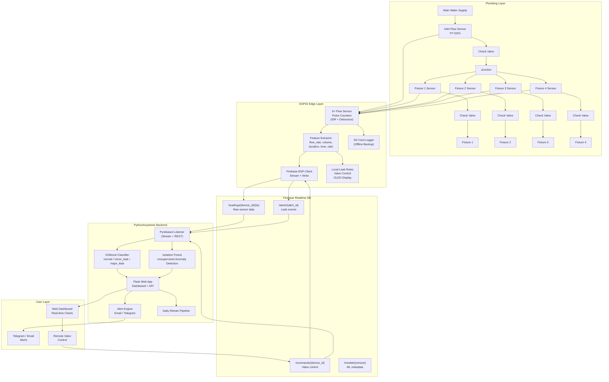

# System Architecture

## Overview

Smart water monitoring system with **fixture-level leak detection** using **ESP32 → Firebase → PythonAnywhere → XGBoost ML**.

The system uses 1 inlet flow sensor to measure total consumption and 4 fixture flow sensors to monitor individual water outlets. Data flows from the ESP32 to Firebase Realtime DB via the [Firebase-ESP-Client](https://github.com/mobizt/Firebase-ESP-Client) library (stream + regular calls). A PythonAnywhere backend consumes the Firebase data using Pyrebase4, runs **XGBoost** and **Isolation Forest** ML models, and serves a web dashboard.

---

## Architecture Diagram



---

## Data Flow (End-to-End)

```
Step 1: SENSING
        Inlet Sensor (GPIO 34)  ─┐
        Fixture 1 Sensor (35)   ─┤  Every 1 second:
        Fixture 2 Sensor (32)   ─┤  → Read pulse count via ISR
        Fixture 3 Sensor (33)   ─┤  → Debounce (5ms)
        Fixture 4 Sensor (25)   ─┘  → Calculate flow rate & volume

Step 2: LOCAL PROCESSING
        For each fixture:
        → flow_rate = (pulse_count * 60) / (PPL * interval_s)
        → volume = pulse_count / PPL
        → total_liters += volume
        → Inlet balance = inlet_volume - sum(fixtures_volume)

Step 3: FIREBASE UPLOAD (every 5–60 seconds via Firebase-ESP-Client)
        → Write to /readings/{device_id}/{timestamp}
        → Stream listener for /commands/{device_id}

Step 4: PYTHONANYWHERE PROCESSING (real-time via Pyrebase4 stream)
        → Listen to /readings/{device_id}
        → Extract features for ML
        → Run XGBoost inference
        → Run Isolation Forest anomaly score
        → If leak detected → write to /alerts/ + trigger notification

Step 5: USER ACTION
        → Dashboard displays real-time readings
        → Telegram / Email alert sent
        → User sends valve command → /commands/{device_id}
        → ESP32 Firebase listener receives command → activates relay
```

---

## Communication Paths

| Path | Method | Protocol | Library |
|------|--------|----------|---------|
| ESP32 → Firebase | Write + Stream | HTTPS/SSE | Firebase-ESP-Client |
| Firebase → ESP32 | Stream Listener | Server-Sent Events | Firebase-ESP-Client |
| PythonAnywhere → Firebase | Read + Stream + Write | REST/SSE | Pyrebase4 |
| Firebase → PythonAnywhere | Stream Listener | Server-Sent Events | Pyrebase4 |
| User → Dashboard | HTTP/WebSocket | HTTPS | Flask + JavaScript |
| Dashboard → Valve | Write to /commands | HTTPS | Fetch API |

---

## Key Design Decisions

| Decision | Rationale |
|----------|-----------|
| **Firebase over custom server** | Managed real-time DB, built-in auth, no server maintenance |
| **Firebase-ESP-Client** | Most mature Firebase library for ESP32, supports streaming (SSE) |
| **Pyrebase4** | Python Firebase client with stream support for PythonAnywhere |
| **XGBoost on PythonAnywhere** | More powerful than edge ML — no model size limits, faster training, GPU support |
| **Isolation Forest + XGBoost** | XGBoost for known leak patterns, Isolation Forest for unknown anomalies |
| **Check Valves per Fixture** | Prevents backflow contamination between fixtures |
| **SD Card Backup** | Survives WiFi/Firebase outages — data never lost |
