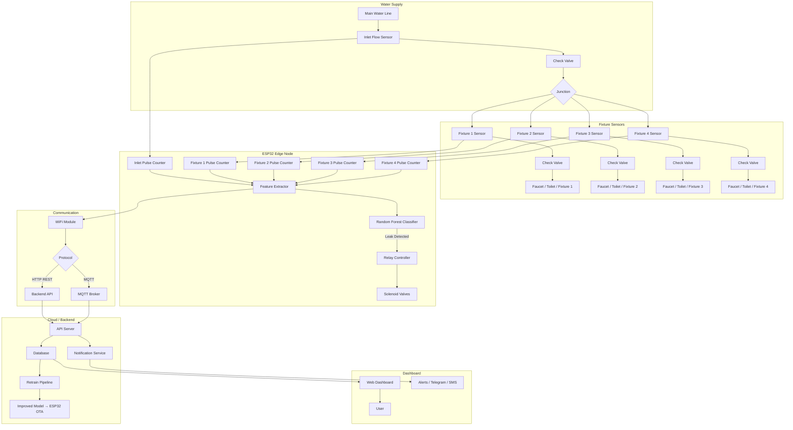
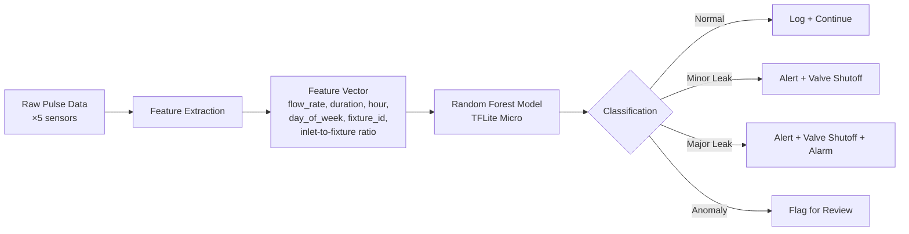

# System Architecture

## Overview

Smart water monitoring system with **fixture-level leak detection**. Uses 1 inlet flow sensor + 4 fixture flow sensors to detect leaks and anomalies via a Random Forest machine learning model.

## Architecture Diagram

## System Flow

1. **Inlet sensor** measures total water entering the system
2. **4 fixture sensors** measure individual consumption per fixture
3. **ESP32** reads all 5 sensors via hardware interrupts
4. **Feature extraction** computes per-fixture metrics: flow rate, duration, start/end times, daily patterns
5. **Random Forest model** (TFLite Micro) classifies each event as:
   - ✅ Normal usage
   - ⚠️ Minor leak (drip)
   - 🚨 Major leak (burst / stuck valve)
   - ❓ Anomaly (unrecognized pattern)
6. **If leak detected** → ESP32 triggers relay → closes solenoid valve on that fixture
7. **Data logged** locally (SD card) and uploaded to server
8. **Backend** stores readings, retrains model periodically, sends alerts

## ML Pipeline

## Key Features

- **Real-time monitoring** — 5 flow sensors read simultaneously via interrupts
- **Fixture-level leak detection** — identify exactly which fixture is leaking
- **Check valves** prevent backflow between fixtures
- **Solenoid shutoff** — automatic valve closure on leak detection
- **ML-powered** — Random Forest model tuned for water usage patterns
- **Local + Cloud** — runs on ESP32 edge; backend for dashboard and retraining
- **OTA updates** — model and firmware updates over the air
